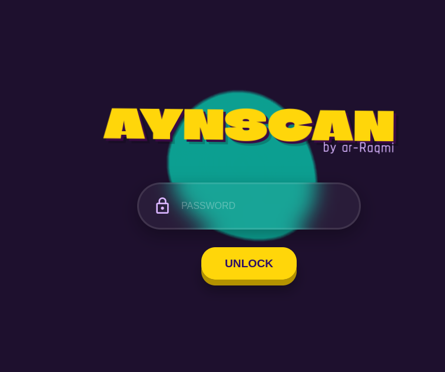
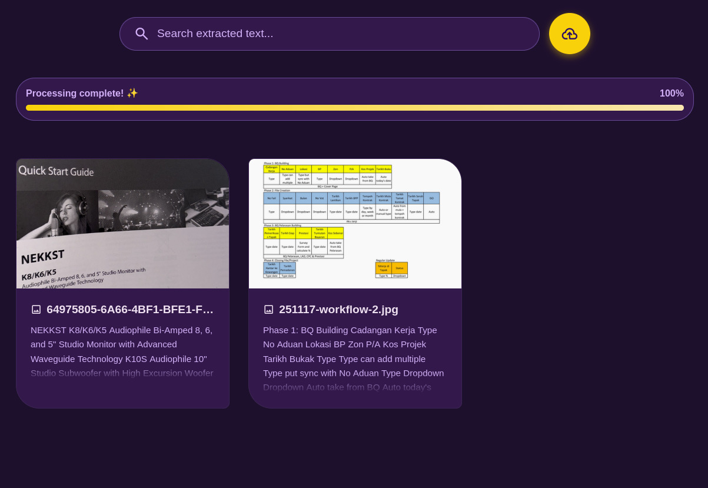
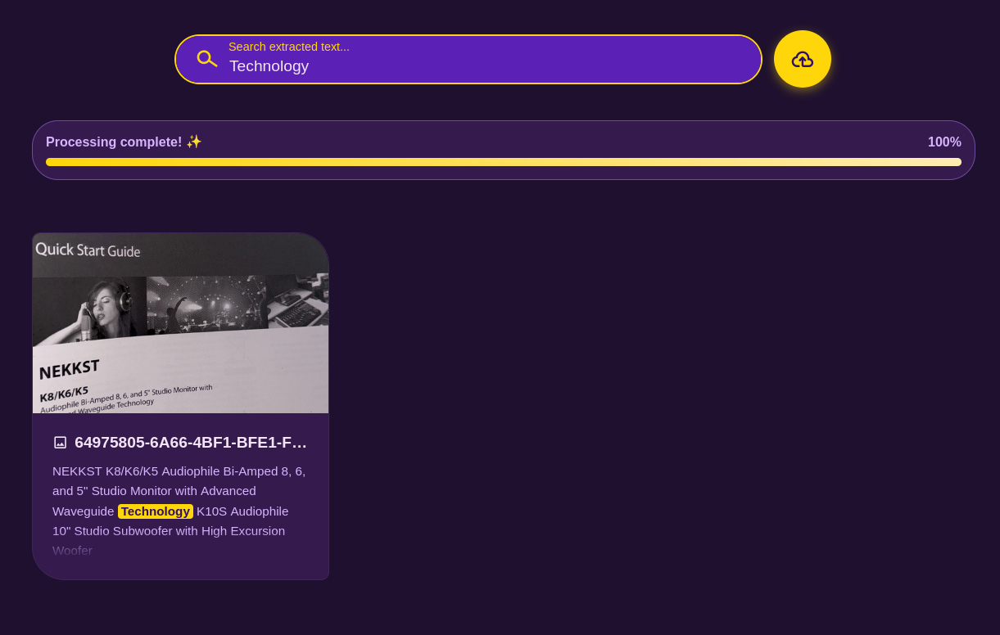
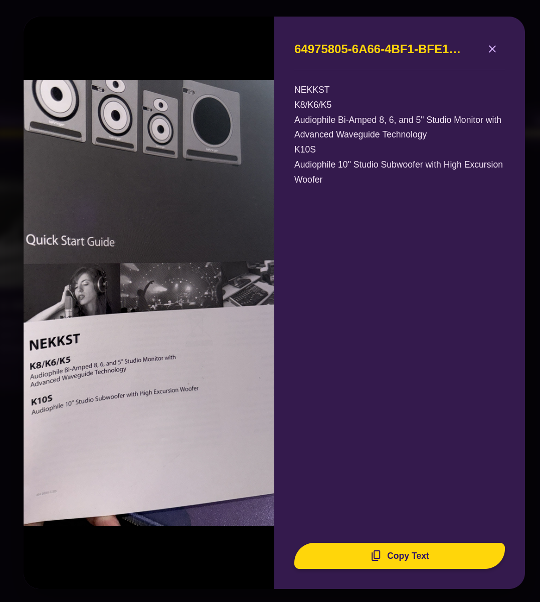

<div align="center">
    <h1>【〈 Aynscan 〉】</h1>
    <h3>High-performance web-based OCR with AI-powered text extraction</h3>
</div>

<div align="center">


</div>

<div align="center">
    <h2>⊙ overview ⊙</h2>
    <h3>Privacy-first, edge-processed document digitization</h3>
</div>

<details open>
  <summary>Notable features</summary>

  - **Batch Processing**: Upload up to 100 images at once with concurrent processing (3 at a time).
  - **AI-Powered OCR**: Leverages Cloudflare Workers AI (Llama 3.2 Vision) for high-accuracy text extraction.
  - **Real-time Search**: Instantly filter through processed documents using the built-in search bar.
  - **Responsive Design**: A modern, Material Design-inspired interface that works across devices.
  - **PWA Ready**: Can be installed on your device for a native-like experience.
</details>

<details>
  <summary>Installation & Getting Started</summary>

  ### Prerequisites
  - Node.js (v18 or later)
  - Cloudflare Account (for Workers AI)

  ### Quick Start
  1. Clone and install:
     ```bash
     git clone https://github.com/ar-raqmi/aynscan.git
     cd aynscan
     npm install
     ```
  2. Configure `.env.local`:
     ```env
     VITE_CF_ACCOUNT_ID=your_cloudflare_account_id
     VITE_CF_API_TOKEN=your_cloudflare_api_token
     ```
  3. Run development:
     ```bash
     npm run dev
     ```

  ### Deployment (Cloudflare Pages)
  1. Connect your GitHub repository to **Cloudflare Pages**.
  2. Set the **Build command** to `npm run build`.
  3. Set the **Build output directory** to `dist`.
  4. Add the following **Environment Variables** in the Cloudflare Dashboard:
     - `CF_API_TOKEN`: Your Cloudflare API Token (used by the backend proxy).
     - `VITE_CF_ACCOUNT_ID`: Your Cloudflare Account ID.
     - `VITE_CF_API_TOKEN`: Your Cloudflare API Token (used by the frontend for local dev, can be same as above).

  ### Security & Authentication
  - **Default Password**: `password`
  - **How to Change**: To change the access password, edit the `PASSWORD_HASH` constant in `components/Login.tsx`:
    ```typescript
    const PASSWORD_HASH = 'your_new_password_here';
    ```
</details>

<details>
  <summary>Software overview (Tech Stack)</summary>

  | Software | Purpose |
  | ------------- | ------------- |
  | [React 19](https://react.dev/) | Frontend framework |
  | [TypeScript](https://www.typescriptlang.org/) | Type-safe development |
  | [Vite](https://vitejs.dev/) | High-speed build tool |
  | [Cloudflare Workers AI](https://developers.cloudflare.com/workers-ai/) | Edge-based AI inference (Llama 3.2 Vision) |

</details>

<div align="center">
    <h2>⊙ screenshots ⊙</h2>
    <h3>Visual guide to the application interface</h3>
</div>

| Authentication | Upload & Processing |
|:---|:---------------|
|  |  |
| **Image Queue** | **Search Functionality** |
|  |  |

<div align="center">
    <br />
    <strong>Detailed Extraction View</strong>
    <br />
    
</div>

<div align="center">
    <h2>⊙ project structure ⊙</h2>
    <h3>Modular architecture for scalability</h3>
</div>

- `components/`: Reusable UI components.
- `services/`: Logic for interacting with AI APIs (Cloudflare Workers AI).
- `functions/api/cf/`: Cloudflare Pages Functions for proxying API requests.
- `App.tsx`: Main application entry point.

<div align="center">
    <h2>⊙ thank you ⊙</h2>
    <h3>Open-source contributions and support</h3>
</div>

- This project is licensed under the GNU General Public License v3.0 - see the [LICENSE](LICENSE) file for details.

---

<div align="center">
    Developed with ❤️ by <strong>ar-Raqmi</strong>
</div>